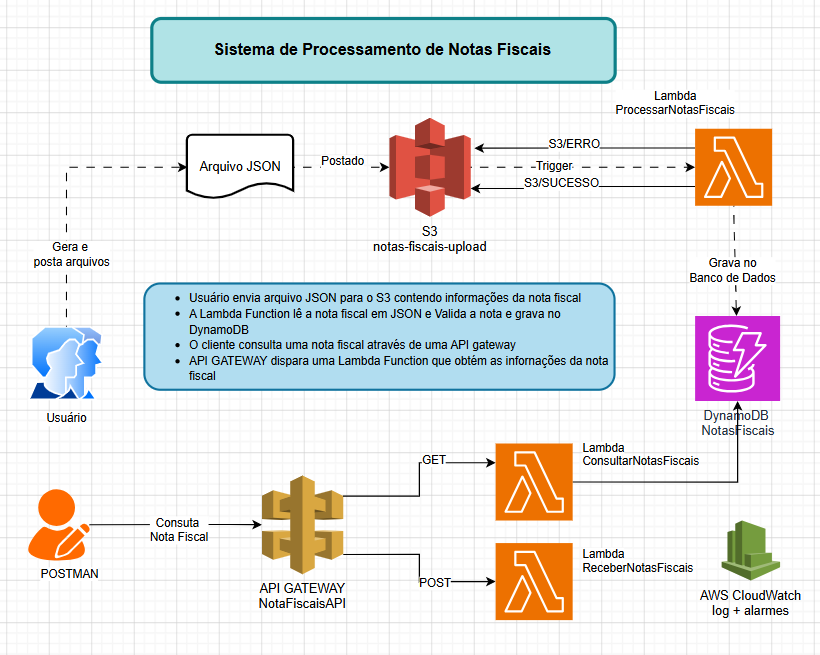

# 🚀 Desafio LocalStack — Sistema de Notas Fiscais na AWS

### Projeto do Bootcamp da GFT ministrado pela DIO

Simulação de uma arquitetura serverless AWS usando **LocalStack**, com processamento de notas fiscais via S3, Lambda, DynamoDB, API Gateway e CloudWatch.

---

## 📋 Índice

- [Visão Geral](#visão-geral)
- [Arquitetura](#arquitetura)
- [Pré-requisitos](#pré-requisitos)
- [Estrutura do Projeto](#estrutura-do-projeto)
- [Configuração e Instalação](#configuração-e-instalação)
- [Infraestrutura — setup.sh](#infraestrutura--setupsh)
- [Lambdas](#lambdas)
  - [ProcessarNotasFiscais — Ingestão via S3](#processarnotasfiscais--ingestão-via-s3)
  - [ConsultarNotasFiscais — GET /notas](#consultarnotasfiscais--get-notas)
  - [ReceberNotasFiscais — POST /notas](#recebernotasfiscais--post-notas)
- [S3 — Bucket e Diretórios](#s3--bucket-e-diretórios)
- [API Gateway](#api-gateway)
- [CloudWatch](#cloudwatch)
- [Postman — Testando a API](#postman--testando-a-api)
- [Testes via Terminal](#testes-via-terminal)

---

## 🧩 Visão Geral

O sistema gerencia notas fiscais em dois fluxos principais:

**Fluxo 1 — Ingestão via S3**
O usuário faz upload de um arquivo JSON para o bucket S3. O upload dispara automaticamente a Lambda `ProcessarNotasFiscais`, que valida e grava os dados no DynamoDB. O arquivo é então movido para o diretório `SUCESSO/` ou `ERRO/` conforme o resultado.

**Fluxo 2 — API REST**
O cliente consulta ou cadastra notas fiscais diretamente via API Gateway, que roteia as requisições para as Lambdas `ConsultarNotasFiscais` (GET) e `ReceberNotasFiscais` (POST).

---

## Arquitetura

```
┌──────────────────────────────────────────────────────────────┐
│  FLUXO 1 — Ingestão via S3                                   │
│                                                              │
│  Usuário → Upload JSON → S3 (notas-fiscais-upload/)          │
│                               │                              │
│                          trigger S3                          │
│                               │                              │
│                               ▼                              │
│                  Lambda: ProcessarNotasFiscais               │
│                    ├─ Valida tipo de arquivo                 │
│                    ├─ Valida campos obrigatórios             │
│                    ├─ Verifica duplicatas                    │
│                    ├─ Grava no DynamoDB                      │
│                    │                                         │
│                    ├─ SUCESSO → S3/SUCESSO/DATAHORA_nome.json│
│                    └─ ERRO    → S3/ERRO/DATAHORA_nome.json   │
└──────────────────────────────────────────────────────────────┘

┌─────────────────────────────────────────────────────────────┐
│  FLUXO 2 — API REST                                         │
│                                                             │
│  Cliente → GET  /notas         → ConsultarNotasFiscais      │
│         → GET  /notas?id=NF-1  → ConsultarNotasFiscais      │
│         → POST /notas          → ReceberNotasFiscais        │
│                                        │                    │
│                                        ▼                    │
│                                   DynamoDB                  │
│                                   NotasFiscais              │
└─────────────────────────────────────────────────────────────┘
```

---

## Pré-requisitos

| Ferramenta | Versão mínima | Instalação |
|-----------|--------------|-----------|
| Docker | 24+ | [docs.docker.com](https://docs.docker.com) |
| Python | 3.12 | [python.org](https://python.org) |
| awscli-local | qualquer | `pip install awscli-local` |
| jq | qualquer | `sudo apt install jq` |
| zip / unzip | qualquer | `sudo apt install zip unzip` |
| Postman | qualquer | [postman.com](https://postman.com) |

### Iniciando o LocalStack

```bash
docker compose up -d

# Verificar se está saudável
curl -s http://localhost:4566/_localstack/health | jq .services
```

### Ativar o ambiente virtual

```bash
source ~/.venv/bin/activate
```

---

## Estrutura do Projeto

```
desafio-localstack/
├── README.md
├── infra/
│   ├── setup.sh                  # Script de criação da infraestrutura
│   └── zips/                     # Pacotes ZIP das Lambdas (gerados pelo setup.sh)
│       ├── processar.zip
│       ├── consultar.zip
│       └── receber.zip
├── lambdas/
│   ├── ingestao/
│   │   └── handler.py            # Lambda ProcessarNotasFiscais
│   ├── consulta/
│   │   └── handler.py            # Lambda ConsultarNotasFiscais
│   └── receber/
│       └── handler.py            # Lambda ReceberNotasFiscais
├── testes/
│   ├── notas_fiscais.json                          # JSON válido com 10 notas
│   ├── notas_fiscais_id_duplicado.json             # JSON com IDs já cadastrados
│   └── notas_fiscais_id_duplicado_com_id_novo.json # JSON misto
└── postman/
    └── NotaFiscaisAPI.postman_collection.json
```

---

## Configuração e Instalação

```bash
# 1. Clonar o repositório
git clone https://github.com/seu-usuario/desafio-localstack.git
cd desafio-localstack

# 2. Ativar ambiente virtual
source ~/.venv/bin/activate

# 3. Instalar dependências
pip install awscli-local
sudo apt install -y jq zip unzip

# 4. Subir o LocalStack
docker compose up -d

# 5. Criar toda a infraestrutura
cd infra && ./setup.sh
```

---

## Infraestrutura — `setup.sh`

O script `infra/setup.sh` cria e configura todos os recursos AWS de forma automatizada e idempotente — pode ser executado múltiplas vezes sem conflitos, pois limpa os recursos anteriores antes de recriar.

Este script cria todos os recursos necessários da nossa solução : S3, DynamoDB, Lambdas, API Gateway, CloudWatch Logs

### Variáveis principais

```bash
REGION="us-east-1"
ACCOUNT_ID="000000000000"
BUCKET="notas-fiscais-upload"
TABLE="NotasFiscais"
LAMBDA_PROCESSAR="ProcessarNotasFiscais"
LAMBDA_CONSULTAR="ConsultarNotasFiscais"
LAMBDA_RECEBER="ReceberNotasFiscais"
API_NAME="NotaFiscaisAPI"
```

### Etapas executadas

**1. Validação da estrutura**
Verifica se os três `handler.py` existem antes de iniciar. Aborta com erro se algum estiver faltando.

**2. Limpeza de recursos anteriores**
Remove bucket, tabela, Lambdas e log groups existentes para garantir uma criação limpa.

**3. Criação do bucket S3**
Cria o bucket `notas-fiscais-upload` e os diretórios virtuais `SUCESSO/` e `ERRO/`.

**4. Criação da tabela DynamoDB**
Cria a tabela `NotasFiscais` com chave primária `id` (String) e billing mode `PAY_PER_REQUEST`.

**5. Empacotamento das Lambdas**
Gera os arquivos ZIP de cada Lambda na pasta `infra/zips/`.

**6. Criação das Lambdas**
Cria as três funções Lambda com runtime `python3.12` e injeta as variáveis de ambiente:

```bash
TABLE_NAME=NotasFiscais
AWS_ENDPOINT_URL=http://<IP_DOCKER>:4566   # IP do container LocalStack
```

> O `AWS_ENDPOINT_URL` usa o IP real do container Docker (descoberto automaticamente via `docker inspect`), pois dentro do container da Lambda `localhost` não resolve para o LocalStack.

**7. Permissão e trigger S3**
Concede permissão ao S3 para invocar a Lambda `ProcessarNotasFiscais` e configura o evento `s3:ObjectCreated:*` com filtro de suffix `.json`.

**8. API Gateway**
Cria a API `NotaFiscaisAPI` com o recurso `/notas` e configura os métodos GET e POST em modo `AWS_PROXY`, apontando para as respectivas Lambdas. Faz deploy no stage `dev`.

**9. CloudWatch**
Cria log groups com retenção de 30 dias, filtros de métricas para erros e alarmes para monitoramento.

### Como executar

```bash
cd infra
./setup.sh
```

### Saída esperada

```
==> Verificando estrutura do projeto...
    ✔ lambdas/ingestao/handler.py encontrado.
    ✔ lambdas/consulta/handler.py encontrado.
    ✔ lambdas/receber/handler.py encontrado.
==> Limpando recursos anteriores (se existirem)...
==> Criando bucket 'notas-fiscais-upload'...
    ✔ Bucket e diretórios criados.
==> Criando tabela DynamoDB 'NotasFiscais'...
    ✔ Tabela 'NotasFiscais' criada.
...
✅  Infraestrutura criada com sucesso!
```

---

## Lambdas

Todas as Lambdas utilizam:
- **Runtime:** Python 3.12
- **Log estruturado:** JSON com campos `acao`, `level` e `request_id`
- **Métricas customizadas:** publicadas no CloudWatch via `put_metric_data`
- **Endpoint:** variável de ambiente `AWS_ENDPOINT_URL` para conectar ao LocalStack

---

### `ProcessarNotasFiscais` — Ingestão via S3

**Arquivo:** `lambdas/ingestao/handler.py`
**Trigger:** Upload de arquivo `.json` no bucket `notas-fiscais-upload/`
**Namespace CloudWatch:** `NotasFiscais/Processamento`

#### Funcionamento

```
Upload .json no S3
      │
      ▼
Lê o arquivo do S3
      │
      ▼
Parse do JSON
(aceita objeto {} ou lista [{}])
      │
      ▼
Para cada item da lista:
  ├─ Valida campos obrigatórios
  ├─ Verifica se já existe no DynamoDB
  │     ├─ Duplicado → skipa + incrementa duplicatas
  │     └─ Novo      → grava + incrementa sucessos
      │
      ▼
sucessos > 0 → move para SUCESSO/DATAHORA_nome_original.json
sucessos = 0 → move para ERRO/DATAHORA_nome_original.json
```

#### Campos obrigatórios do JSON

| Campo | Tipo | Descrição |
|-------|------|-----------|
| `id` | string | Identificador único da nota |
| `cliente` | string | Nome do cliente |
| `valor` | number | Valor da nota |
| `data_emissao` | string | Data no formato `YYYY-MM-DD` |

#### Exemplo de JSON aceito

```json
[
  {
    "id": "NF-1",
    "cliente": "Carlos Santos",
    "valor": 1111.11,
    "data_emissao": "2026-05-01"
  },
  {
    "id": "NF-2",
    "cliente": "José Santos",
    "valor": 2222.22,
    "data_emissao": "2026-02-02"
  }
]
```

#### Regras de destino no S3

| Situação | Destino |
|----------|---------|
| Pelo menos 1 item gravado | `SUCESSO/` |
| Todos os itens duplicados | `ERRO/` |
| Todos os itens com erro de validação | `ERRO/` |
| JSON malformado | `ERRO/` |
| Extensão inválida (não `.json`) | ignorado pelo trigger |

#### Métricas publicadas

| Métrica | Quando |
|---------|--------|
| `NotasProcessadas` | Item gravado com sucesso |
| `NotasDuplicadas` | Item já existe no DynamoDB |
| `NotasComErroValidacao` | Campos inválidos ou ausentes |
| `NotasComErroInesperado` | Erros de infraestrutura |

---

### `ConsultarNotasFiscais` — GET `/notas`

**Arquivo:** `lambdas/consulta/handler.py`
**Trigger:** GET `/notas` via API Gateway
**Namespace CloudWatch:** `NotasFiscais/API`

#### Endpoints

| Requisição | Comportamento |
|-----------|--------------|
| `GET /notas` | Lista todas as notas (scan com paginação) |
| `GET /notas?id=NF-1` | Busca nota específica pelo ID |

#### Respostas

| Status | Situação |
|--------|---------|
| 200 | Nota encontrada ou listagem realizada |
| 404 | Nota com o ID informado não encontrada |
| 503 | Tabela DynamoDB não encontrada |
| 500 | Erro interno inesperado |

#### Exemplo de resposta — listagem

```json
{
  "total": 2,
  "notas": [
    {
      "id": "NF-1",
      "cliente": "Carlos Santos",
      "valor": "1111.11",
      "data_emissao": "2026-05-01"
    }
  ]
}
```

#### Métricas publicadas

| Métrica | Quando |
|---------|--------|
| `ConsultasRealizadas` | Nota encontrada por ID |
| `ConsultasNaoEncontradas` | ID não encontrado |
| `ListagensRealizadas` | Listagem completa realizada |
| `ErrosInternos` | Erro de infraestrutura |

---

### `ReceberNotasFiscais` — POST `/notas`

**Arquivo:** `lambdas/receber/handler.py`
**Trigger:** POST `/notas` via API Gateway
**Namespace CloudWatch:** `NotasFiscais/API`

#### Funcionamento

Recebe um objeto JSON no body da requisição, valida os campos e grava diretamente no DynamoDB — sem passar pelo S3.

#### Campos obrigatórios no body

| Campo | Tipo | Validação |
|-------|------|-----------|
| `id` | string | Não vazio |
| `cliente` | string | Não vazio |
| `valor` | number | Deve ser numérico |
| `data_emissao` | string | Formato `YYYY-MM-DD` (10 caracteres) |

#### Exemplo de body

```json
{
  "id": "NF-100",
  "cliente": "Empresa Postman Ltda",
  "valor": 4500.00,
  "data_emissao": "2026-05-24"
}
```

#### Respostas

| Status | Situação |
|--------|---------|
| 201 | Nota cadastrada com sucesso |
| 400 | Body vazio ou JSON malformado |
| 409 | Nota com esse ID já existe |
| 422 | Campos inválidos ou ausentes |
| 503 | Tabela DynamoDB não encontrada |
| 500 | Erro interno inesperado |

#### Métricas publicadas

| Métrica | Quando |
|---------|--------|
| `NotasCadastradas` | Nota gravada com sucesso |
| `NotasDuplicadas` | ID já existente |
| `RequisicoesInvalidas` | Body vazio, JSON inválido ou campos ausentes |
| `ErrosInternos` | Erro de infraestrutura |

---

## S3 — Bucket e Diretórios

### Bucket: `notas-fiscais-upload`

O bucket possui três zonas:

```
s3://notas-fiscais-upload/
├── (raiz)       ← arquivos enviados pelo usuário
├── SUCESSO/     ← arquivos processados com sucesso
└── ERRO/        ← arquivos com falha no processamento
```

### Como funciona o fluxo

1. O usuário faz upload de um arquivo `.json` para a **raiz** do bucket
2. O evento `s3:ObjectCreated:*` dispara a Lambda `ProcessarNotasFiscais`
3. A Lambda processa o arquivo e o move para `SUCESSO/` ou `ERRO/`
4. O arquivo é renomeado com data e hora preservando o nome original:

```
nome original : notas_fiscais_id_duplicado.json
após SUCESSO  : SUCESSO/20260524_124558_notas_fiscais_id_duplicado.json
após ERRO     : ERRO/20260524_124105_notas_fiscais_id_duplicado.json
```

### Diretório `SUCESSO/`

Contém arquivos cujo processamento resultou em **pelo menos um item gravado** no DynamoDB. Arquivos com mix de itens novos e duplicados também vão para `SUCESSO/` — desde que ao menos um item tenha sido gravado.

### Diretório `ERRO/`

Contém arquivos cujo processamento **não gravou nenhum item** no DynamoDB. Isso inclui:

- JSON malformado
- Todos os campos obrigatórios ausentes
- Todos os itens já cadastrados (duplicatas)
- Erros de conexão com o DynamoDB

### Comandos úteis

```bash
# Listar todos os arquivos do bucket
awslocal s3 ls s3://notas-fiscais-upload/ --recursive

# Ver apenas arquivos em SUCESSO
awslocal s3 ls s3://notas-fiscais-upload/SUCESSO/

# Ver apenas arquivos em ERRO
awslocal s3 ls s3://notas-fiscais-upload/ERRO/

# Fazer upload de um arquivo para processamento
awslocal s3 cp testes/notas_fiscais.json s3://notas-fiscais-upload/notas_fiscais.json
```

---

## API Gateway

**Nome:** `NotaFiscaisAPI`
**Stage:** `dev`
**Base URL:** `http://localhost:4566/restapis/{API_ID}/dev/_user_request_`

### Obter a URL base

```bash
API_ID=$(awslocal apigateway get-rest-apis \
  --query "items[?name=='NotaFiscaisAPI'].id" --output text)

echo "Base URL: http://localhost:4566/restapis/${API_ID}/dev/_user_request_"
```

### Rotas disponíveis

| Método | Path | Lambda | Descrição |
|--------|------|--------|-----------|
| GET | `/notas` | ConsultarNotasFiscais | Lista todas as notas |
| GET | `/notas?id={id}` | ConsultarNotasFiscais | Busca nota por ID |
| POST | `/notas` | ReceberNotasFiscais | Cadastra nova nota |

---

## CloudWatch

### Log Groups

| Log Group | Lambda |
|-----------|--------|
| `/aws/lambda/ProcessarNotasFiscais` | Ingestão S3 |
| `/aws/lambda/ConsultarNotasFiscais` | GET /notas |
| `/aws/lambda/ReceberNotasFiscais` | POST /notas |

Retenção configurada: **30 dias**

### Consultar logs

```bash
# Acompanhar logs em tempo real
awslocal logs tail /aws/lambda/ProcessarNotasFiscais --follow
awslocal logs tail /aws/lambda/ConsultarNotasFiscais --follow
awslocal logs tail /aws/lambda/ReceberNotasFiscais --follow

# Filtrar apenas erros
awslocal logs filter-log-events \
  --log-group-name /aws/lambda/ProcessarNotasFiscais \
  --filter-pattern '"ERROR"'
```

### Alarmes configurados

| Alarme | Métrica | Threshold |
|--------|---------|-----------|
| `AlarmErrosProcessamento` | `ErrosProcessamento` | ≥ 1 erro/min |
| `AlarmErrosAPI` | `ErrosInternos` | ≥ 3 erros/min |
| `AlarmNotasDuplicadas` | `NotasDuplicadas` | ≥ 5 em 5 min |

```bash
# Verificar estado dos alarmes
awslocal cloudwatch describe-alarms \
  --query "MetricAlarms[*].{Nome:AlarmName,Estado:StateValue}" \
  --output table
```

---

## Postman — Testando a API

### Importar a collection

1. Abra o Postman
2. Clique em **Import**
3. Selecione o arquivo `postman/NotaFiscaisAPI.postman_collection.json`
4. Clique em **Import**

### Configurar o Environment

1. Clique em **Environments** → **Add**
2. Nomeie como `LocalStack`
3. Adicione a variável:

| Variable | Value |
|----------|-------|
| `base_url` | `http://localhost:4566/restapis/SEU_API_ID/dev/_user_request_` |

4. Selecione o environment `LocalStack` no dropdown superior direito

### Requisições disponíveis

#### GET — Listar todas as notas
```
GET {{base_url}}/notas
```
Resposta esperada: `200` com lista de notas e total.

#### GET — Buscar nota por ID
```
GET {{base_url}}/notas?id=NF-1
```
Resposta esperada: `200` com os dados da nota ou `404` se não encontrada.

#### POST — Cadastrar nota válida
```
POST {{base_url}}/notas
Content-Type: application/json

{
  "id": "NF-100",
  "cliente": "Empresa Postman Ltda",
  "valor": 4500.00,
  "data_emissao": "2026-05-24"
}
```
Resposta esperada: `201` com a nota cadastrada.

#### POST — Cenários de erro

| Body enviado | Status esperado | Motivo |
|-------------|----------------|--------|
| Nota já existente | `409` | ID duplicado |
| Campos faltando | `422` | Validação falhou |
| Body vazio | `400` | Body obrigatório |
| JSON malformado | `400` | Parse falhou |
| `valor: "abc"` | `422` | Valor não numérico |

### Executar todos os testes de uma vez

No Postman, clique com o botão direito na collection **NotaFiscaisAPI** → **Run collection**. Todos os cenários serão executados em sequência com os status esperados.

NotaFiscaisAPI.postman_collection.json

```
{
  "info": {
    "name": "NotaFiscaisAPI",
    "description": "Collection para teste da API de Notas Fiscais no LocalStack",
    "schema": "https://schema.getpostman.com/json/collection/v2.1.0/collection.json"
  },
  "variable": [
    {
      "key": "base_url",
      "value": "http://localhost:4566/restapis/SEU_API_ID/dev/_user_request_",
      "type": "string"
    }
  ],
  "item": [
    {
      "name": "GET",
      "item": [
        {
          "name": "Listar todas as notas",
          "request": {
            "method": "GET",
            "header": [],
            "url": {
              "raw": "{{base_url}}/notas",
              "host": ["{{base_url}}"],
              "path": ["notas"]
            },
            "description": "Retorna todas as notas fiscais cadastradas no DynamoDB."
          }
        },
        {
          "name": "Buscar nota por ID",
          "request": {
            "method": "GET",
            "header": [],
            "url": {
              "raw": "{{base_url}}/notas?id=NF-1",
              "host": ["{{base_url}}"],
              "path": ["notas"],
              "query": [
                {
                  "key": "id",
                  "value": "NF-1",
                  "description": "ID da nota fiscal"
                }
              ]
            },
            "description": "Busca uma nota fiscal específica pelo ID."
          }
        },
        {
          "name": "Buscar nota inexistente (404)",
          "request": {
            "method": "GET",
            "header": [],
            "url": {
              "raw": "{{base_url}}/notas?id=NF-999",
              "host": ["{{base_url}}"],
              "path": ["notas"],
              "query": [
                {
                  "key": "id",
                  "value": "NF-999",
                  "description": "ID inexistente — deve retornar 404"
                }
              ]
            },
            "description": "Deve retornar 404 — nota não encontrada."
          }
        }
      ]
    },
    {
      "name": "POST",
      "item": [
        {
          "name": "Cadastrar nota válida (201)",
          "request": {
            "method": "POST",
            "header": [
              {
                "key": "Content-Type",
                "value": "application/json"
              }
            ],
            "body": {
              "mode": "raw",
              "raw": "{\n  \"id\": \"NF-100\",\n  \"cliente\": \"Empresa Postman Ltda\",\n  \"valor\": 4500.00,\n  \"data_emissao\": \"2026-05-24\"\n}",
              "options": {
                "raw": {
                  "language": "json"
                }
              }
            },
            "url": {
              "raw": "{{base_url}}/notas",
              "host": ["{{base_url}}"],
              "path": ["notas"]
            },
            "description": "Cadastra uma nova nota fiscal. Deve retornar 201."
          }
        },
        {
          "name": "Cadastrar nota duplicada (409)",
          "request": {
            "method": "POST",
            "header": [
              {
                "key": "Content-Type",
                "value": "application/json"
              }
            ],
            "body": {
              "mode": "raw",
              "raw": "{\n  \"id\": \"NF-100\",\n  \"cliente\": \"Empresa Postman Ltda\",\n  \"valor\": 4500.00,\n  \"data_emissao\": \"2026-05-24\"\n}",
              "options": {
                "raw": {
                  "language": "json"
                }
              }
            },
            "url": {
              "raw": "{{base_url}}/notas",
              "host": ["{{base_url}}"],
              "path": ["notas"]
            },
            "description": "Tenta cadastrar nota já existente. Deve retornar 409."
          }
        },
        {
          "name": "Campos faltando (422)",
          "request": {
            "method": "POST",
            "header": [
              {
                "key": "Content-Type",
                "value": "application/json"
              }
            ],
            "body": {
              "mode": "raw",
              "raw": "{\n  \"id\": \"NF-101\",\n  \"cliente\": \"Empresa Incompleta\"\n}",
              "options": {
                "raw": {
                  "language": "json"
                }
              }
            },
            "url": {
              "raw": "{{base_url}}/notas",
              "host": ["{{base_url}}"],
              "path": ["notas"]
            },
            "description": "Campos obrigatórios ausentes. Deve retornar 422."
          }
        },
        {
          "name": "Body vazio (400)",
          "request": {
            "method": "POST",
            "header": [
              {
                "key": "Content-Type",
                "value": "application/json"
              }
            ],
            "body": {
              "mode": "raw",
              "raw": "",
              "options": {
                "raw": {
                  "language": "json"
                }
              }
            },
            "url": {
              "raw": "{{base_url}}/notas",
              "host": ["{{base_url}}"],
              "path": ["notas"]
            },
            "description": "Body vazio. Deve retornar 400."
          }
        },
        {
          "name": "JSON malformado (400)",
          "request": {
            "method": "POST",
            "header": [
              {
                "key": "Content-Type",
                "value": "application/json"
              }
            ],
            "body": {
              "mode": "raw",
              "raw": "isso nao e um json",
              "options": {
                "raw": {
                  "language": "json"
                }
              }
            },
            "url": {
              "raw": "{{base_url}}/notas",
              "host": ["{{base_url}}"],
              "path": ["notas"]
            },
            "description": "JSON malformado. Deve retornar 400."
          }
        },
        {
          "name": "Valor não numérico (422)",
          "request": {
            "method": "POST",
            "header": [
              {
                "key": "Content-Type",
                "value": "application/json"
              }
            ],
            "body": {
              "mode": "raw",
              "raw": "{\n  \"id\": \"NF-102\",\n  \"cliente\": \"Empresa Teste\",\n  \"valor\": \"abc\",\n  \"data_emissao\": \"2026-05-24\"\n}",
              "options": {
                "raw": {
                  "language": "json"
                }
              }
            },
            "url": {
              "raw": "{{base_url}}/notas",
              "host": ["{{base_url}}"],
              "path": ["notas"]
            },
            "description": "Valor não numérico. Deve retornar 422."
          }
        }
      ]
    }
  ]
}
```

---

## Testes via Terminal

```bash
# Descobrir a BASE_URL
API_ID=$(awslocal apigateway get-rest-apis \
  --query "items[?name=='NotaFiscaisAPI'].id" --output text)
BASE_URL="http://localhost:4566/restapis/${API_ID}/dev/_user_request_"

# POST — nota válida
curl -s -X POST $BASE_URL/notas \
  -H "Content-Type: application/json" \
  -d '{"id":"NF-001","cliente":"Empresa ABC","valor":1500.00,"data_emissao":"2026-05-24"}' | jq

# GET — listar todas
curl -s $BASE_URL/notas | jq

# GET — buscar por ID
curl -s "$BASE_URL/notas?id=NF-001" | jq

# Upload via S3
awslocal s3 cp testes/notas_fiscais.json s3://notas-fiscais-upload/notas_fiscais.json
sleep 3
awslocal s3 ls s3://notas-fiscais-upload/SUCESSO/
awslocal s3 ls s3://notas-fiscais-upload/ERRO/

# Verificar DynamoDB
awslocal dynamodb scan \
  --table-name NotasFiscais \
  --query "Count"
```
---

## Imagens do projeto


### ✅ Diagrama de arquitetura com S3, Lambda, DynamoDB e API Gateway usando localstack





### ✅ Postman - Buscar nota fiscal por "id"


### ✅ Postman - GET /notas listando todas as notas fiscais com status 200


### ✅ Postman - POST /notas cadastrando nova nota com status 201


### ✅ Postman - POST /notas com nota duplicada retornando status 409


### ✅ LOCALSTACK - S3 - Bucket notas-fiscais-upload


### ✅ LOCALSTACK - Tabela NotaFiscais no DYNAMODB


### ✅ LOCALSTACK - Lambdas


### ✅ LOCALSTACK - CloudWatch Logs Groups


## 👤 Autor

Ademar Silva Barreto Júnior

### LinkedIn (https://www.linkedin.com/in/ademarsilvabarretojunior/)